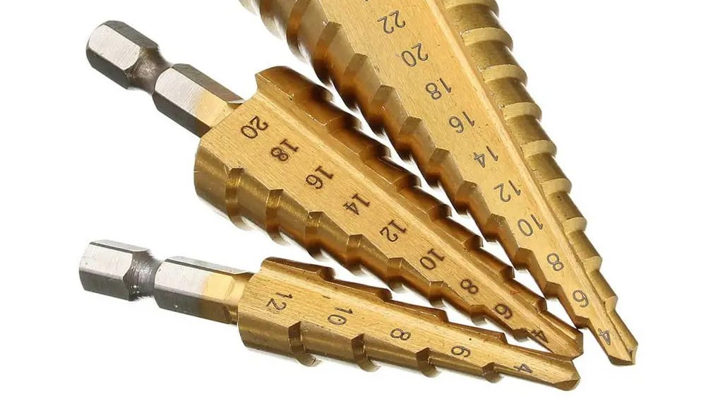
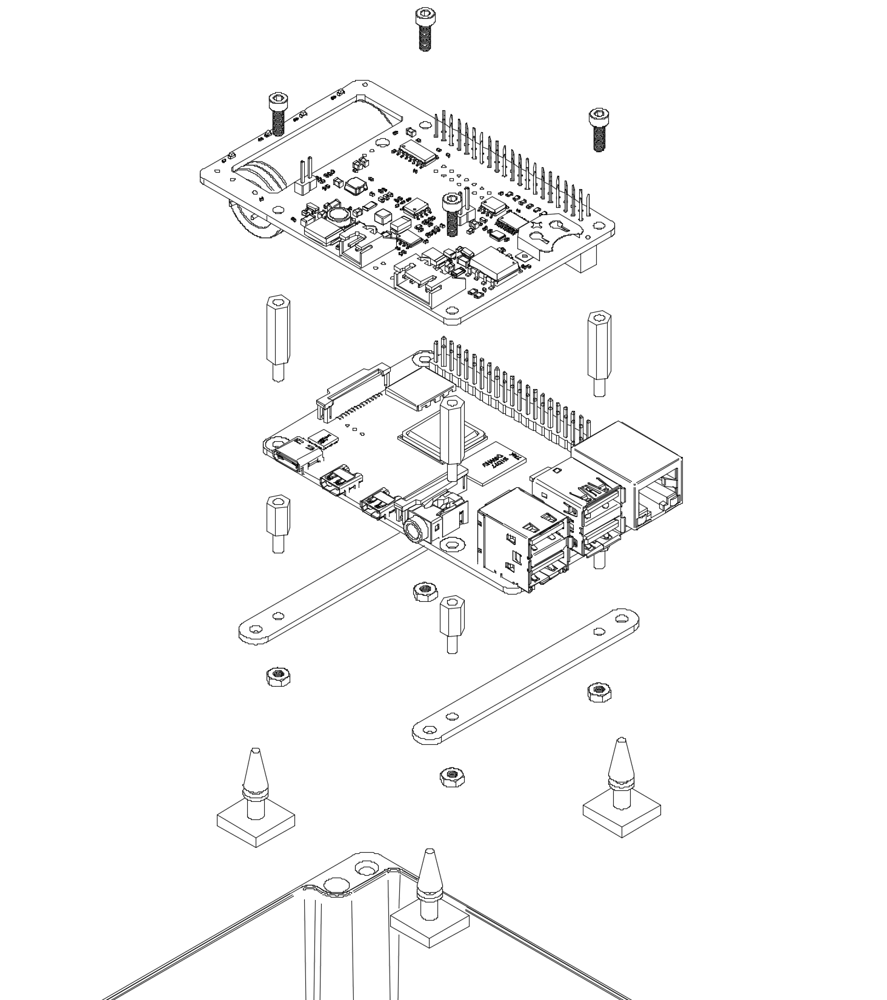
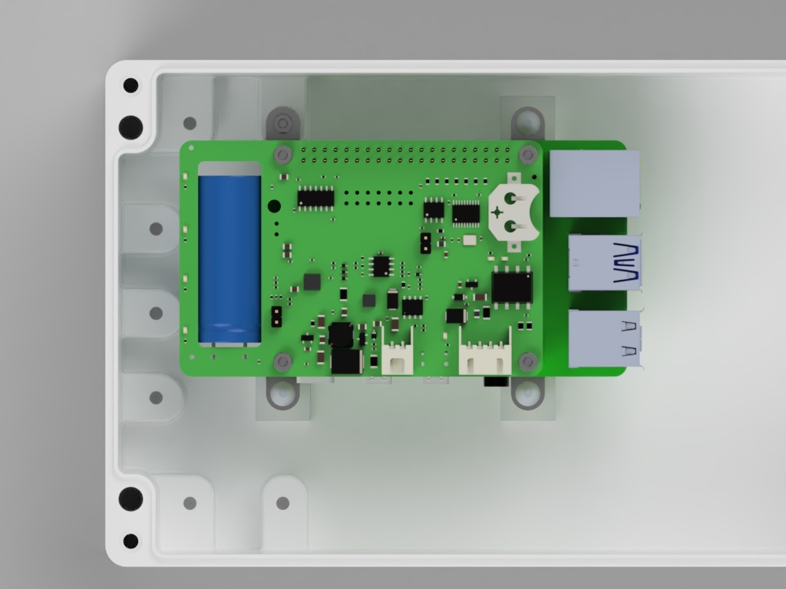
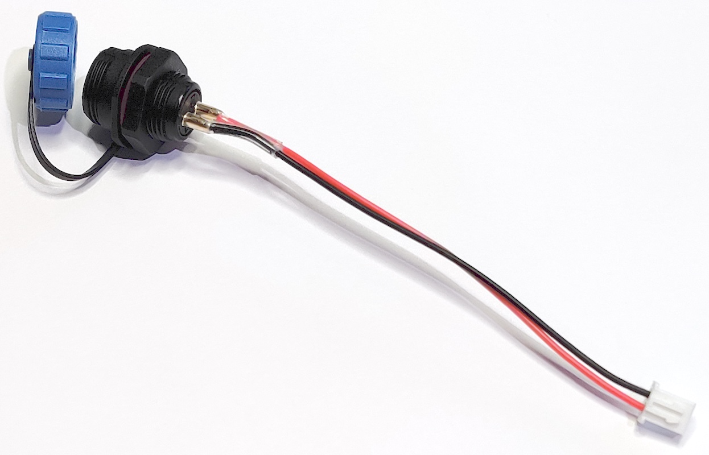
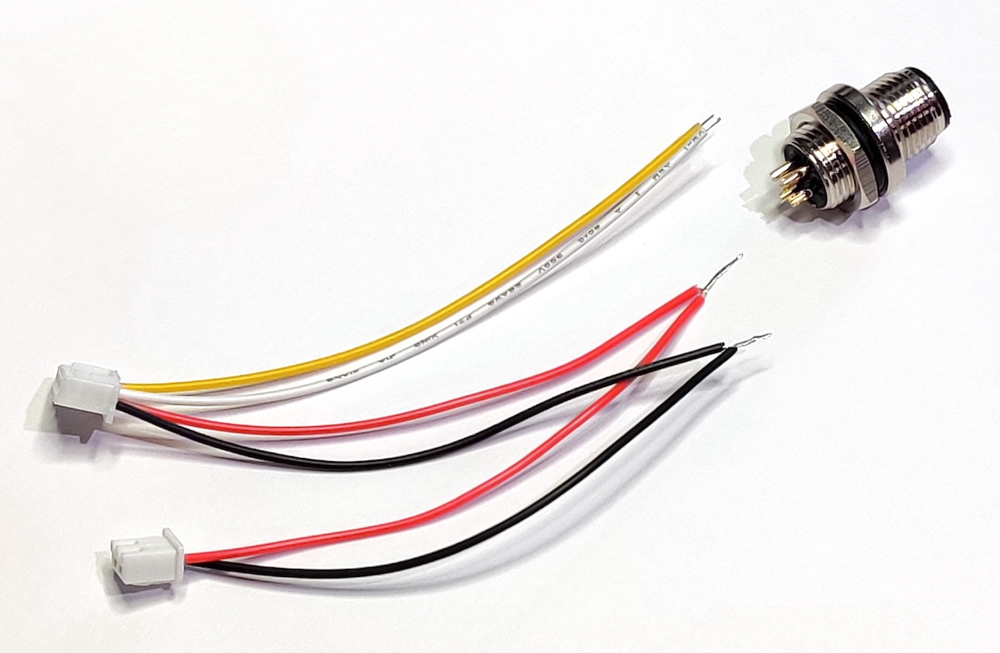
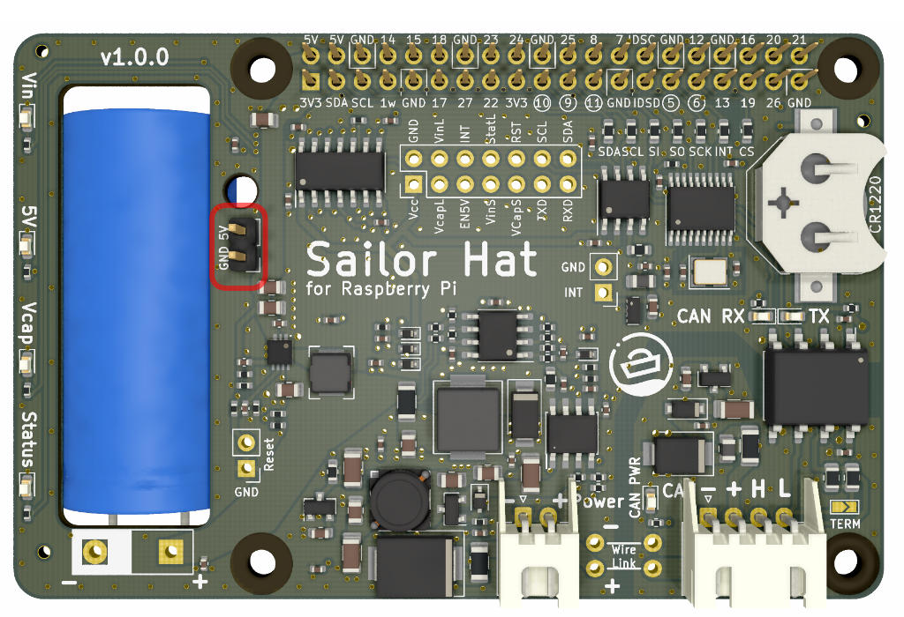

# Getting started
{: .no_toc }

## Table of contents
{: .no_toc .text-delta }

1. TOC
{:toc}

## Hardware assembly

SH-RPi is delivered fully assembled. The hardware installation steps are:

1. Mount the Raspberry Pi (not included) in an enclosure of your choice (not included)
2. Plug the SH-RPi on the Raspberry Pi GPIO header (optionally using the hex standoffs)
3. Connect the JST XH power 2-pin power cable
4. Connect the JST XH CAN bus (NMEA 2000) jumper cable

### Enclosures

If you are going to use your Raspberry Pi and SH-RPi on a boat, you should always place the device in a waterproof enclosure!
Hat Labs offers two different types of waterproof enclosures.

[RND 455-00388](https://hatlabs.fi/product/metal-enclosure-200x120x75/) is an IP 65 rated aluminum enclosure with dimensions of 200x120x75mm.
The size is sufficient for a Raspberry Pi and some peripherals, while not being excessively large.
It offers excellent environmental and electromagnetic protection as well as thermal conductivity, but also blocks WiFi signals.
Therefore, an external WiFi antenna needs to be used with it.
Also, LEDs or status displays are obviously not visible unless LED light pipes or a plastic window aperture are installed.

[RND 455-00138](https://hatlabs.fi/product/plastic-enclosure-240x120x60/) is a polycarbonate plastic box with a clear lid and IP 65 rating.
Its outer dimensions are 120x240x60mm, making it spacious enough for more peripherals.
Even though it is plastic, it is large enough to provide sufficient surface area to provide adequate heat dissipation even for a Raspberry Pi 4B and some accessories.

### Drilling holes

The enclosures don't have any pre-drilled holes for connectors or wire glands on them.
At a very minimum, you need one hole for power or NMEA 2000 input, and on the metal enclosure, another for a WiFi antenna or a wired ethernet connector.

Plan the hole/connector placement to fit your intended installation location.
If you are planning to wall-mount the enclosure, place the connectors under the enclosure to minimize the chances for water ingress.

Both aluminum and polycarbonate are relatively soft and can be drilled with a step drill bit (one that looks like a small metal Christmas tree).
When drilling plastic, standard metal drill bits may easily bite too hard and crack the wall.

{:width="50%"}\\
*An example of step drill bits.*

Suitable hole sizes for different connectors:

- SMA (WiFi antenna): 6.5-7 mm or 1/4"
- PG7 cable gland and M12 (NMEA 2000) panel connector: 12 mm or 1/2"
- SP13 panel connectors (blue-black plastic connectors): 13-14 mm.
  1/2" probably works with a bit of wiggling.
- PG9 cable gland: 16 mm or 5/8"
- RJ45 panel connector: TODO
- USB type A panel connector: TODO
- HDMI panel connector: TODO

### Mounting the Raspberry Pi

A Raspberry Pi can be mounted on the enclosure with the [Raspberry Pi mount adapters](https://hatlabs.fi/product/rpi-mount-adapter) and the adhesive spacers.

\\
*An exploded view of assembly with the suggested components.*

Mount at least one of the adapter screws on the enclosure holes for secure attachment.
This will reduce the likelihood of the Raspberry Pi rattling around the enclosure if the adhesives are not firmly attached.

{:width="50%"}\\
*An example mounting of the SH-RPi in an enclosure.*

### Power and NMEA 2000 connections

SH-RPi can always be powered using a dedicated power connector.

It is also possible to power the SH-RPi via the NMEA 2000 network, provided that there are no galvanic connections to external wired hardware. For details, refer to the [NMEA 2000 power](nmea2000-power/) page.

If power is provided via a dedicated power connector, install a panel connector on the enclosure and solder the provided JST XH pigtail cable to the panel connector.

{:width="50%"}\\
*JST XH pigtail soldered to an SP13 panel connector.*

If you want to power the Raspberry Pi via the NMEA 2000 network, splice the black and red wires of the JST XH pigtail cables together as shown in the following picture:

{:width="50%"}\\
*Two JST XH pigtails spliced together.*

### Soldering the panel connectors

When soldering the internal wires to the panel connectors, always use heat shrink tube on the individual wires.
Always remember to slide the heat shrink on the wires _before_ soldering...
Usually you can first add solder to the connector pin cavity and then re-melt the solder and insert the wire.

### Connecting a fan

Placing a fan inside the enclosure is recommended to improve air circulation and heat transfer through the enclosure surfaces.
A small 40mm fan can be mounted in the enclosure with two-sided tape or hot glue. For maximal cooling efficiency, it should be pointed to blow air to the space between the Raspberry Pi and the Sailor Hat.

The fan should be connected to the dedicated 5V header on the SH-RPi:

{:width="50%"}

## Software installation

Some additional configuration changes and software are required for the Raspberry Pi OS to detect the new CAN bus interface and to run the system service that will automatically initiate system shutdown once the power is cut.

### Automatic installation

A fully automated installation script is provided. The script is tested on newly flashed Raspberry Pi OS and might fail on a heavily modified system. Installation has not been tested on any other operating systems.

To run the automated installation script, copy-paste the following command onto the Raspberry Pi command prompt:

    curl -L \
        https://raw.githubusercontent.com/hatlabs/SH-RPi-daemon/main/install.sh \
        | sudo bash

The command will fetch the installation script and execute it automatically.

### Manual installation

Manual installation of the required software is possible but not yet documented. Follow the steps taken in the [installation script](https://github.com/hatlabs/SH-RPi-daemon/blob/master/install.sh) and the [overlay makefile](https://github.com/hatlabs/SH-RPi-daemon/blob/master/overlays/Makefile).
